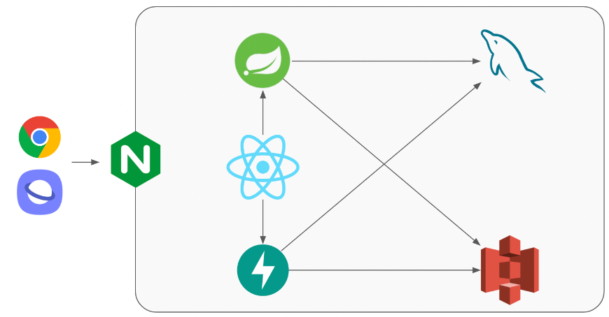

# Findit! - README
## 1. 프로젝트 소개
[Findit!](https://findit.life/) : Object Detection과 Classification을 활용한 온오프라인 연계 보물찾기 실시간 웹 게임

## 프로젝트 배경
	- 어린시절 친구들과 놀던 때로 돌아가고 싶은 어른들의 욕구
	- 핸드폰 게임을 하느라 밖에서 놀지 않는 아이들도 야외에서 움직있게 하고 싶은 부모님의 바람
이러한 요구사항을 해소하기 위해 과거에 자주 하고 놀았던 보물찾기 게임을 현대화했습니다.
숨겨둔 보물을 핸드폰으로 인식하여 점수를 획득하고 대결하는 실시간 웹 게임을 제작하게 되었습니다.

## 2. 프로젝트 요약
- 기술스택

- 아키텍처    

## 3. 팀원 소개 및 담당 역할
- 최희선 (heesunmelody@gmail.com) : Restful API, Websocket, Infra, UCC

## 4. Wiki
- [Wiki 바로가기](https://lab.ssafy.com/s07-ai-image-sub2/S07P22A203/-/wikis/home)
- API 문서, ERD 설계, Wireframe, Convention 등 정리
